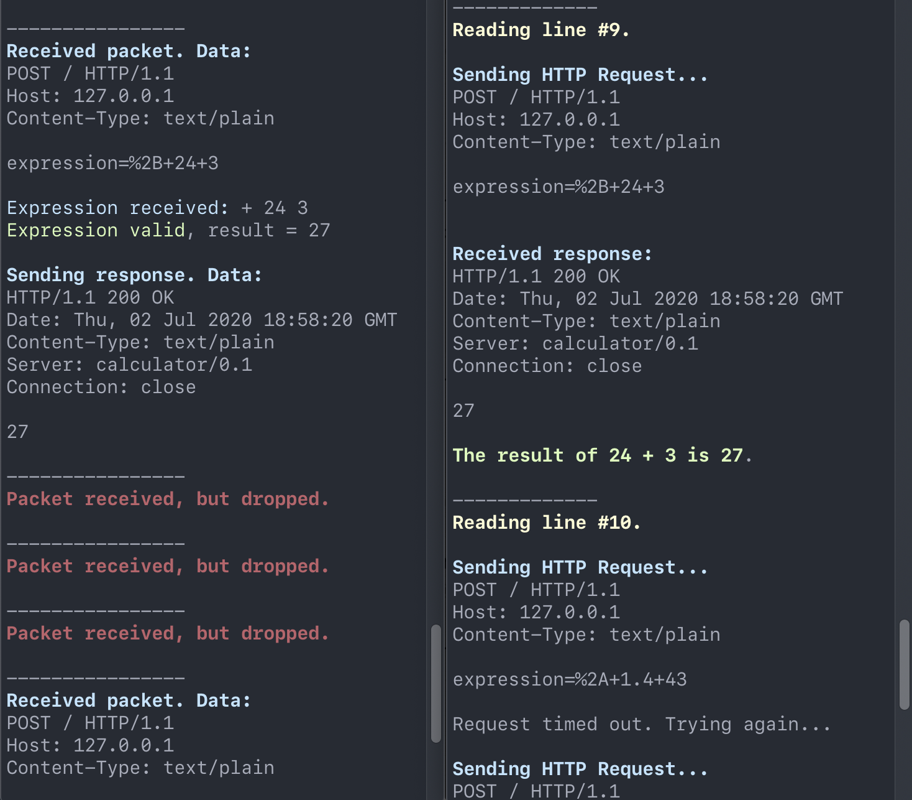

# Python TCP/UDP server/client simulation

This project implements an HTTP server using TCP and UDP that performs
arithmetic calculations and a client that sends requests from an input file.

I implemented a reliable TCP server, a reliable UDP server and an unreliable UDP
server that drops the connection with certain probability. The server accepts or
rejects a request based on the syntax and returns the calculation result.
The client tries to re-establish a connection if the server does not respond
until a certain timeout threshold.

All communications between the server and the client are output to the terminal.




## Operations

The server accepts four binary arithmetic operations, +, -, \*, / in prefix
(Polish) notation and returns an HTTP 200 status with the result. Only integers
are allowed. The server rejects the request and returns a HTTP 406 Not
Acceptable status if the expression is invalid.


## TCP reliable server/client

To run a reliable TCP server

```python TCP-Server.py```

To run a reliable TCP client reading from a text file where each operation is
separated by line breaks

```python TCP-Client.py [input-file]```


## UDP reliable server/client

To run a reliable UDP server

```python UDP-Server.py```

To run a reliable UDP client reading from a text file

```python UDP-Client.py [input-file]```


## UDP unreliable server/client

To run a unreliable UDP server with probability between 0.0 and 1.0 of dropping
a packet

```python UDP-unreliable-Server.py [probability]```

To run a reliable UDP client reading from a text file

```python UDP-unreliable-Client.py [input-file]```
